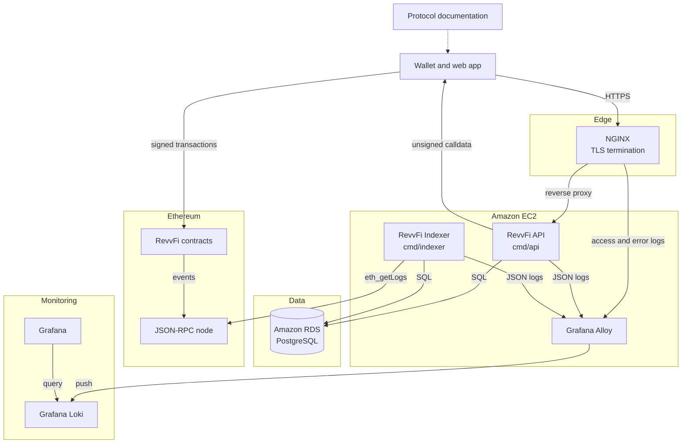
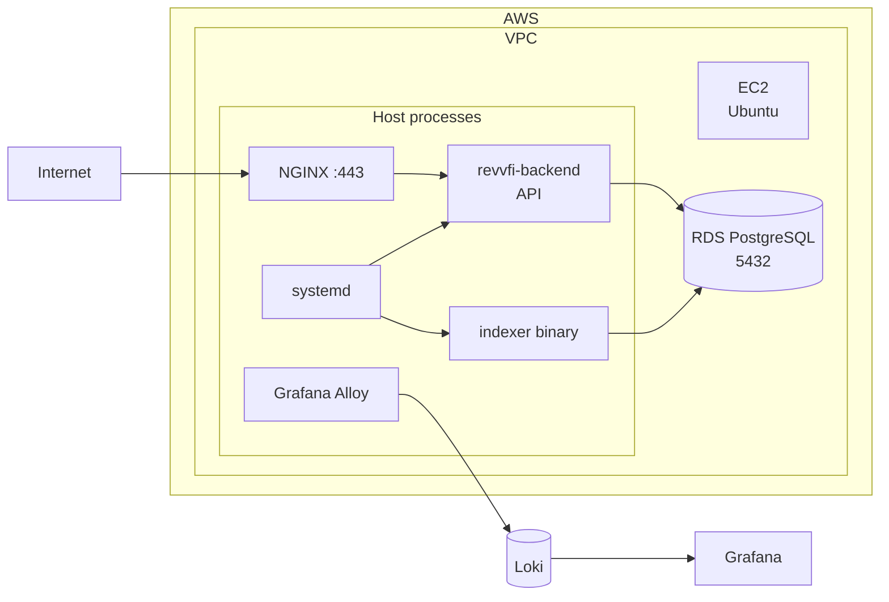
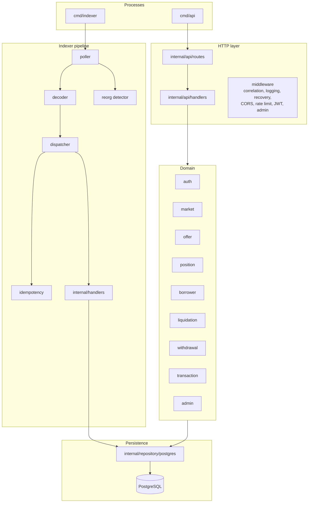
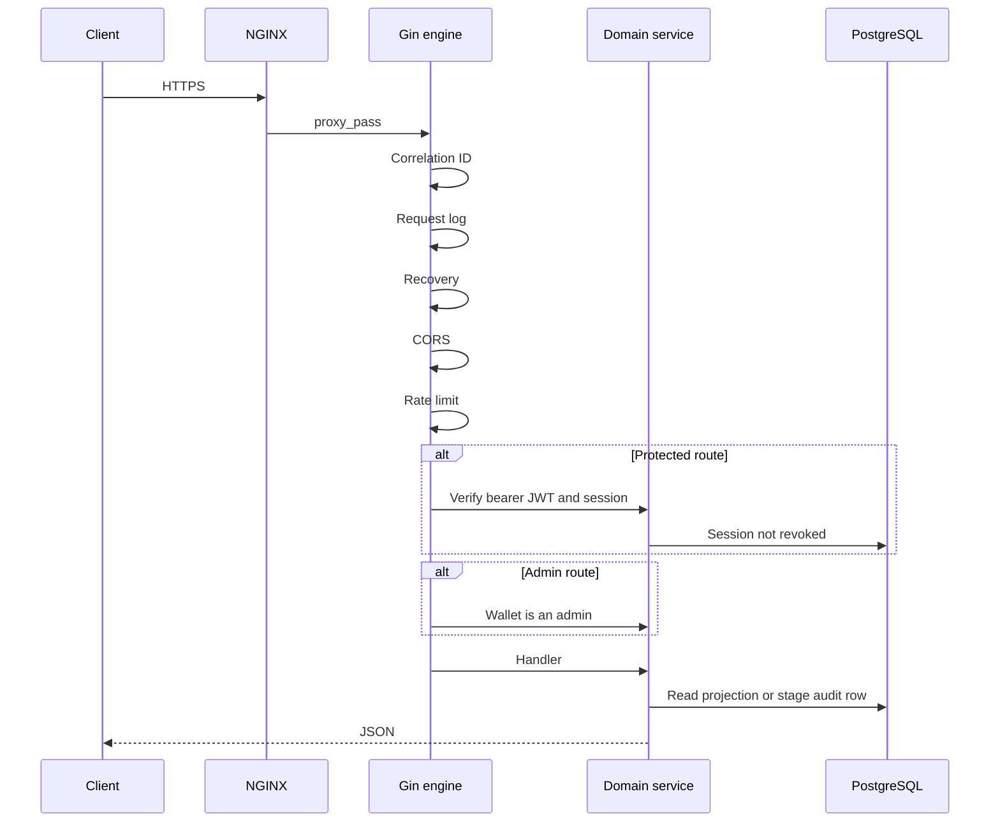
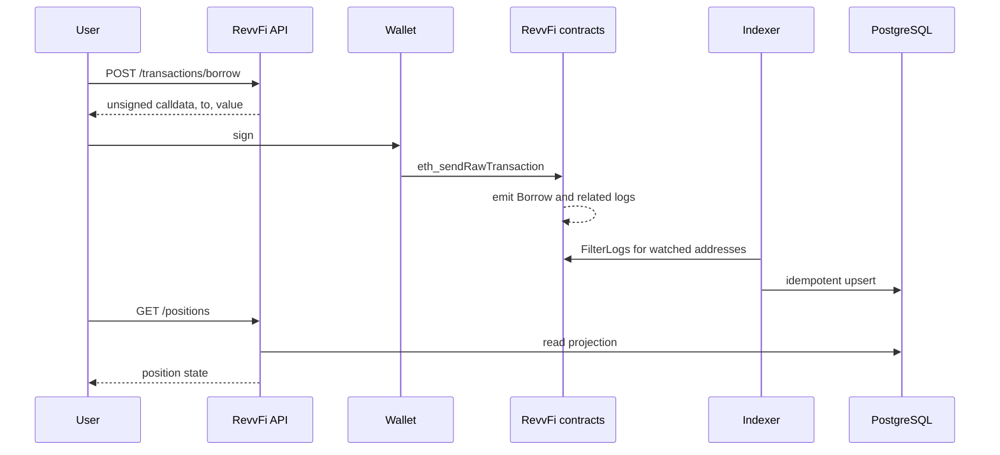
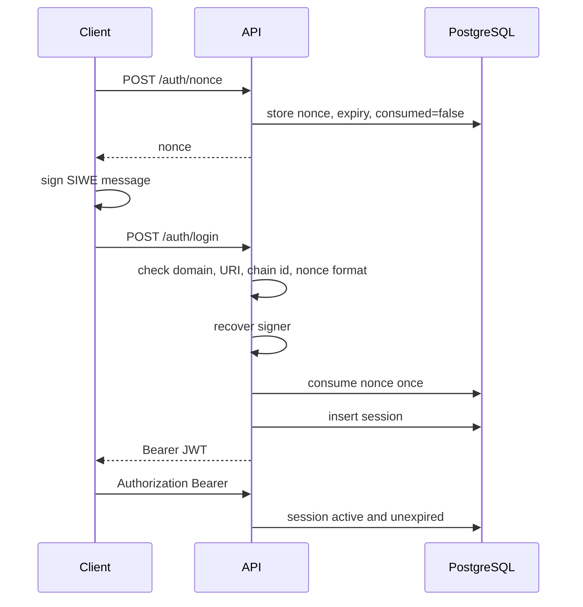
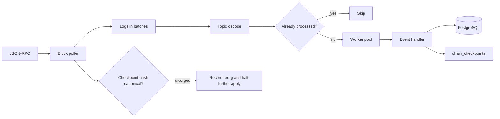
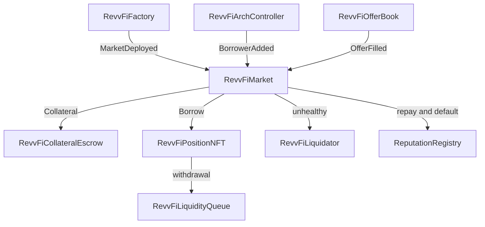
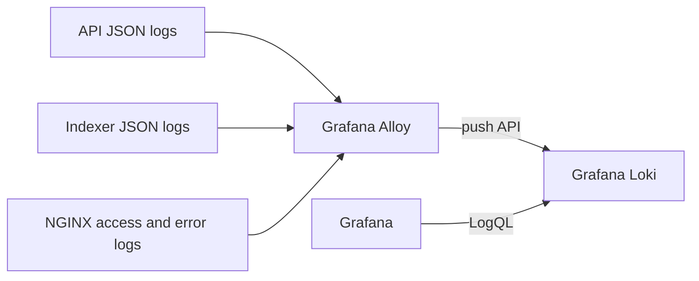

<p align="center">
  
</p>

<h1 align="center">RevvFi Backend</h1>

<p align="center">
  Production API and chain indexer for RevvFi, a fixed-rate peer-to-peer lending protocol.<br/>
  Isolated markets, order-book offers, collateral escrow, Dutch-auction liquidations, and on-chain reputation.
</p>

<p align="center">
  <a href="https://revvfi.xyz">revvfi.xyz</a>
  &nbsp;·&nbsp;
  <a href="https://docs.revvfi.xyz">docs.revvfi.xyz</a>
  &nbsp;·&nbsp;
  <a href="https://github.com/RevvFi">github.com/RevvFi</a>
</p>

<p align="center">
  <a href="https://go.dev"></a>
  &nbsp;&nbsp;
  <a href="https://gin-gonic.com"></a>
  &nbsp;&nbsp;
  <a href="https://www.postgresql.org"></a>
  &nbsp;&nbsp;
  <a href="https://ethereum.org"></a>
  &nbsp;&nbsp;
  <a href="https://nginx.org"></a>
  &nbsp;&nbsp;
  <a href="https://aws.amazon.com"></a>
  &nbsp;&nbsp;
  <a href="https://grafana.com"></a>
  &nbsp;&nbsp;
  <a href="https://grafana.com/oss/loki"></a>
  &nbsp;&nbsp;
  <a href="https://grafana.com/oss/alloy"></a>
  &nbsp;&nbsp;
  <a href="https://prometheus.io"></a>
</p>

<p align="center">
  <sub>Go &nbsp;·&nbsp; Gin &nbsp;·&nbsp; PostgreSQL &nbsp;·&nbsp; Ethereum &nbsp;·&nbsp; NGINX &nbsp;·&nbsp; AWS &nbsp;·&nbsp; Grafana &nbsp;·&nbsp; Loki &nbsp;·&nbsp; Alloy &nbsp;·&nbsp; Prometheus</sub>
</p>

---

## What this service does

RevvFi Backend is the off-chain read and coordination layer for the protocol. Wallets sign every state-changing transaction and submit it to the chain. The backend prepares unsigned calldata, authenticates wallets, and serves a query API over state that the indexer has already committed from confirmed logs.

Two processes share one PostgreSQL database:

| Process | Entrypoint | Role |
| --- | --- | --- |
| HTTP API | `cmd/api` | SIWE sessions, public reads, signed-transaction builders, admin prepare endpoints |
| Chain indexer | `cmd/indexer` | Polls RPC, decodes protocol logs, applies them idempotently, survives reorgs |

The production unit on EC2 starts the API binary. The indexer is a separate binary and is operated alongside it against the same database.

---

## Architecture principles

- **Chain is the source of truth.** Markets, offers, borrows, repayments, liquidations, withdrawals, reputation, and protocol configuration are created by contract calls. The API returns indexed projections of that state.
- **Calldata stays unsigned.** Borrow, repay, liquidate, and admin configuration endpoints return transaction payloads. The wallet signs them. The backend never holds user keys.
- **Clean layering.** HTTP handlers, domain services, and PostgreSQL repositories stay separated. Indexer event handlers write the projection the API later reads.
- **Idempotent indexing.** Each log is identified by transaction hash and log index. Checkpoints record the last canonical block hash so a reorg can be detected before further writes.
- **Structured operations.** Requests carry a correlation id. Logs are JSON. Grafana reads them through Loki, with Alloy as the collector on the host.

---

## System context



Clients talk only to NGINX. NGINX proxies to the API process bound on the instance. The indexer never accepts user traffic. Both processes use the same RDS database. The indexer is the only component that reads chain logs into that database.

---

## Production topology

The service runs on Ubuntu on Amazon EC2. Amazon RDS for PostgreSQL holds protocol, session, and indexer state. NGINX is the public edge: it terminates TLS with a certificate from Let's Encrypt, forwards HTTP to the API, and passes WebSocket upgrade headers for clients that need them.



| Layer | Component | Responsibility |
| --- | --- | --- |
| Compute | Amazon EC2 | Ubuntu host for the API, indexer, NGINX, and Alloy |
| Edge | NGINX | Public HTTPS, reverse proxy to the API, health location without access-log noise |
| Process supervisor | systemd | Restarts the API (`revvfi-backend.service`), captures stdout and stderr |
| Database | Amazon RDS PostgreSQL | Markets, offers, positions, borrowers, auctions, withdrawals, sessions, checkpoints |
| Chain access | JSON-RPC | Sepolia during audits; the same binaries target a later mainnet deployment by changing addresses and chain id |
| Logs | Grafana Alloy | Tails API, indexer, and NGINX logs on the host |
| Log store | Grafana Loki | Retains the structured log stream |
| Dashboards | Grafana | Queries Loki for API latency, indexer lag, reorgs, and error rates |

The deploy path is `deploy.sh`: it builds a static `linux/amd64` binary from `cmd/api`, installs `revvfi-backend.service`, and restarts the unit.

---

## Application shape



| Package | Responsibility |
| --- | --- |
| `cmd/api` | Load config, open Postgres, wire services, serve Gin, shut down on SIGINT/SIGTERM |
| `cmd/indexer` | Dial RPC, build the worker, run until signal |
| `internal/api/routes` | Public, authenticated, and admin route table under `API_BASE_PATH` (default `/api/v1`) |
| `internal/api/handlers` | Request decoding and response mapping |
| `internal/api/dto` | Request and response contracts |
| `internal/api/middleware` | Bearer auth and admin allow-list checks |
| `middleware` | Correlation id, request log, recovery |
| `internal/core` | Protocol rules: quotes, portfolio valuation, Dutch auction price, epoch withdrawals, SIWE, admin calldata |
| `internal/handlers` | One handler family per contract surface; writes the indexed projection |
| `internal/indexer` | Poll, decode, dispatch, retry, checkpoint, reorg |
| `internal/repository/postgres` | SQL and migrations |
| `internal/config` | Environment loading (`.env`, then `.env.production` or `.env.local`) |
| `internal/logger` | JSON `slog` with `service`, `environment`, `timestamp`, and correlation id |
| `internal/blockchain/abis` | Contract artifacts used to decode logs and encode calldata |

---

## Request path

Every API request passes the same edge and middleware chain.



Default listening address is `0.0.0.0:3000` (`API_HOST`, `API_PORT`). NGINX publishes that process. Rate limiting defaults to 120 requests per client per minute. CORS allows the configured web origins and the `X-Correlation-ID` header.

Shutdown waits for in-flight requests up to `API_SHUTDOWN_TIMEOUT` (default 10s).

---

## Blockchain-first writes

A lending action is complete only after the chain emits the matching log and the indexer stores it. The API prepares the call and later serves the result.



The same pattern covers market deployment (`RevvFiFactory.deployMarket`), offers (`RevvFiOfferBook`), borrower registration (`RevvFiArchController`), and admin parameter changes. Admin routes under `*/prepare` return calldata for the admin wallet. Audit rows record the intent; the chain event is what updates protocol state.

---

## Authentication

Sessions follow [EIP-4361](https://eips.ethereum.org/EIPS/eip-4361) (Sign-In with Ethereum), then a bearer JWT.



Nonces are at least 8 alphanumeric characters, unique per wallet, and single use. Sessions can be revoked with `POST /auth/logout`. Admin routes require a valid session and a wallet present in the admin allow-list (`ADMIN_WALLETS`). Impersonation tokens are short-lived JWTs issued only after that allow-list check.

---

## Indexer pipeline

The worker watches the core contracts at startup and adds each deployed market as `MarketDeployed` is applied, so `eth_getLogs` filters stay limited to known addresses.



| Stage | Package | Behavior |
| --- | --- | --- |
| Poll | `internal/indexer/poller` | `FilterLogs` from the last checkpoint through the confirmed head, in `BatchSize` windows. Default poll interval is 3s. |
| Decode | `internal/indexer/decoder` | Maps `topic0` to the event name, then ABI-decodes the log. |
| Dedup | `internal/indexer/idempotency` | Skips a log already stored in `processed_events`. |
| Dispatch | `internal/indexer/processor` | Five workers pull from a buffered channel. Failed logs land in `failed_events` with retry. |
| Reorg | `internal/indexer/reorg` | Compares the stored checkpoint hash with the canonical header from RPC. |
| Registry | `internal/indexer/registry` | Address set passed into every filter: factory, arch controller, position NFT, liquidator, reputation registry, and discovered markets. |

Indexer instruments defined with the Prometheus client:

| Metric | Type | Meaning |
| --- | --- | --- |
| `revvfi_indexer_events_processed_total` | counter, `event_name` | Logs applied, by event |
| `revvfi_indexer_blocks_processed_total` | counter | Blocks walked |
| `revvfi_indexer_block_lag` | gauge | Distance behind chain head |
| `revvfi_indexer_reorgs_detected_total` | counter | Canonical-hash mismatches |
| `revvfi_indexer_processing_errors_total` | counter, `error_type` | Apply failures |

---

## Contracts and events

The indexer follows the protocol contracts. Event names below are the ones registered in `internal/handlers/registry.go`.

| Contract | Indexed behavior |
| --- | --- |
| `RevvFiFactory` | Market deployment, core contract wiring, fee updates, implementation set, ownership, arch-controller updates |
| `RevvFiMarket` | Borrow, repay, interest accrual, collateral move, pause, close, liquidation start and end |
| `RevvFiOfferBook` | Submit, cancel, modify, fill, drawdown |
| `RevvFiPositionNFT` | Mint, settle, redeem, claim, transfer |
| `RevvFiLiquidator` | Auction create, bid, settle, cancel |
| `RevvFiLiquidityQueue` | Withdrawal request, claim, cancel, epoch processing |
| `RevvFiCollateralEscrow` | Collateral deposit, withdraw, liquidate, ratio and threshold updates |
| `RevvFiArchController` | Borrower and controller membership, asset permission, market register, timelock, owner |
| `ReputationRegistry` | Score updates, registration, repayment, default, borrow activity |



A market is an isolated pool for one borrower. Lenders post fixed APR and a seniority tier (senior is repaid first; junior takes first loss). Collateral is priced by Chainlink feeds with a staleness guard enforced in the contracts. Unhealthy debt enters a Dutch auction. Lender exits settle on epoch cycles in the liquidity queue.

---

## Data model

Schema lives in `internal/repository/postgres/migrations`, applied in filename order.

| Area | Tables | Written by |
| --- | --- | --- |
| Sessions | `auth_nonces`, `auth_sessions` | API |
| Protocol | `markets`, `offers`, `positions`, `borrowers`, `repayments`, `collateral_balances` | Indexer |
| Auctions | `auctions`, `bids` | Indexer |
| Liquidity | `withdrawal_requests`, `withdrawal_epochs` | Indexer, with API request records where the flow stages a withdrawal |
| Governance projection | `controllers`, `controller_factories`, `liquidator_config`, `system_config` | Indexer and admin reads |
| Compliance | `admin_audit_logs` | Admin API |
| Indexer control | `processed_events`, `event_topics`, `chain_checkpoints`, `failed_events`, `indexer_sync_state`, `reorg_events` | Indexer |

Monetary amounts are stored as text big-integer strings so values stay exact. Ratios and APR are integer basis points. Wallet addresses are `TEXT` so the schema is not locked to a 42-character hex width.

Connection pool defaults: 25 open connections, 5 idle, 30 minute max lifetime.

---

## HTTP surface

Base path: `/api/v1`.

### Liveness

| Method | Path | Purpose |
| --- | --- | --- |
| GET | `/health` | Process, database, and RPC health |
| GET | `/ready` | Readiness for traffic |

### Authentication

| Method | Path | Auth | Purpose |
| --- | --- | --- | --- |
| POST | `/auth/nonce` | Public | Issue SIWE nonce |
| POST | `/auth/login` | Public | Exchange signature for JWT |
| POST | `/auth/logout` | Bearer | Revoke session |
| GET | `/auth/me` | Bearer | Current wallet |

### Public reads

| Method | Path | Purpose |
| --- | --- | --- |
| GET | `/markets` | List markets |
| GET | `/markets/:address` | Market detail |
| GET | `/markets/:address/metrics` | Market metrics |
| GET | `/offers` | Browse offers |
| GET | `/offers/:offerID` | One offer |
| POST | `/offers/quote` | Quote preview |
| GET | `/borrowers/:address` | Borrower profile |
| GET | `/borrowers/:address/risk` | Risk view |
| GET | `/borrowers/:address/collateral` | Collateral view |
| GET | `/liquidations` | Liquidatable positions |
| GET | `/liquidations/auctions/:auctionID` | Auction detail |
| GET | `/liquidations/auctions/:auctionID/price` | Current Dutch auction price |

### Authenticated protocol

| Method | Path | Purpose |
| --- | --- | --- |
| GET | `/positions` | Caller positions |
| GET | `/positions/portfolio` | Portfolio summary |
| GET | `/positions/:tokenID` | One position |
| POST | `/positions/claim` | Claim payload |
| GET | `/withdrawals` | Caller withdrawals |
| POST | `/withdrawals` | Request withdrawal |
| POST | `/withdrawals/cancel` | Cancel withdrawal |
| GET | `/withdrawals/current-epoch` | Active epoch |
| POST | `/transactions/borrow` | Unsigned borrow |
| POST | `/transactions/repay` | Unsigned repay |
| POST | `/transactions/liquidate` | Unsigned liquidate |
| POST | `/transactions/quote` | Outcome quote |

### Admin

Admin routes sit behind bearer auth and the admin allow-list.

| Group | Paths | Purpose |
| --- | --- | --- |
| Markets | `GET/PATCH /admin/markets...` | Inspect markets and update indexed status |
| Access | `/admin/check/:address`, `/admin/admins`, `/admin/auth/impersonate` | Allow-list inspection and short-lived impersonation |
| Borrowers | `/admin/borrowers...` | List, inspect, prepare add and remove |
| Protocol | `/protocol/config`, fees, core contracts, upgrade queue | Read config and prepare factory and controller calls |
| Risk | `/admin/markets/:address/risk...` | Prepare minimum CR, liquidation threshold, oracle |
| Liquidator | `/admin/liquidator/...` | Config, active auctions, prepare stop |
| Reputation | `/admin/reputation/...` | Defaults, score, prepare set |
| Audit | `/admin/audit/...` | Logs, stats, export, per-admin activity |
| Stats | `/admin/stats/...` | Overview, borrowers, markets, revenue, liquidations, positions |
| Emergency | `/admin/emergency/...` | Prepare pause, unpause, fee drain |
| System | `/admin/system/config` | Read and prepare system configuration |
| Health | `GET /admin/health` | Admin health check |

---

## Observability



The API and indexer initialize `internal/logger` before they serve traffic. Production logs are JSON lines on stdout, with `service` set to `backend` or `indexer`, an ISO-8601 `timestamp`, and `correlation_id` when the HTTP middleware attached one. The systemd unit captures stdout to `/var/log/revvfi-backend.log` and stderr to `/var/log/revvfi-backend-error.log`.

Grafana Alloy runs on the same host. It collects those files together with the NGINX logs and ships them to Grafana Loki. Grafana is the query and dashboard surface over that stream: request correlation, indexer progress, reorg warnings, and RPC or database failures.

Indexer counters in `internal/indexer/metrics` use the Prometheus client library and are the numeric companion to the log stream.

---

## Configuration

Configuration is environment-driven. `ENVIRONMENT=production` loads `.env.production` over `.env`.

| Variable | Default | Meaning |
| --- | --- | --- |
| `ENVIRONMENT` | `development` | `development`, `staging`, or `production` |
| `API_HOST` / `API_PORT` | `0.0.0.0` / `3000` | Listen address |
| `API_BASE_PATH` | `/api/v1` | Route prefix |
| `API_SHUTDOWN_TIMEOUT` | `10s` | Graceful shutdown budget |
| `DB_URL` or `DATABASE_URL` | empty | Full Postgres URL when set |
| `DB_HOST`, `DB_PORT`, `DB_USER`, `DB_PASSWORD`, `DB_NAME` | local defaults | Discrete connection fields |
| `DB_SSL_MODE` | `disable` | `require` against RDS |
| `DB_MAX_CONN` / `DB_MIN_CONN` | `25` / `5` | Pool size |
| `DB_CONN_MAX_LIFETIME` | `30m` | Connection lifetime |
| `JWT_SECRET`, `JWT_EXPIRY`, `JWT_ISSUER` | development placeholder, 86400s, `revvfi` | Session token |
| `CORS_ALLOWED_ORIGINS` | localhost | Browser origins |
| `RATE_LIMIT_REQUESTS` / `RATE_LIMIT_WINDOW` | `120` / `1m` | Per-client limit |
| `RPC_URL`, `CHAIN_ID` | empty, `1` | JSON-RPC and expected chain |
| `ARTIFACT_PATH` | `../out` | ABI directory |
| `FACTORY_ADDRESS` and sibling `*_ADDRESS` | empty | Deployed contract addresses |
| `START_BLOCK` | | First block the indexer should consider |
| `ADMIN_WALLETS` | empty | Comma-separated admin addresses |
| `AUTH_DOMAIN`, `AUTH_URI`, `AUTH_CHAIN_ID` | | SIWE message binding |


---

## Repository map

```text
cmd/api/                         HTTP server
cmd/indexer/                     Chain indexer
internal/api/routes/             Route table
internal/api/handlers/           HTTP handlers
internal/api/dto/                Request and response types
internal/api/middleware/         JWT and admin gates
internal/core/                   Domain services
internal/handlers/               Chain event handlers
internal/indexer/                Poller, decoder, processor, reorg, metrics
internal/repository/postgres/    SQL repositories and migrations
internal/blockchain/abis/        Contract ABIs
internal/config/                 Environment configuration
internal/logger/                 Structured JSON logging
middleware/                      Correlation id and request logging
deploy.sh                        EC2 build and systemd restart
revvfi-backend.service           systemd unit
DEPLOYMENT.md                    Production runbook
```

---

## Local run

```bash
go mod download
# Apply SQL in internal/repository/postgres/migrations in order.
# Point DB_* and RPC_URL at a local Postgres and a Sepolia endpoint.

go run ./cmd/api
go run ./cmd/indexer
```

Health check:

```bash
curl -s http://127.0.0.1:3000/api/v1/health
```

---

